# Administrador (Admin) - User Flows & Sequences

## Overview

The **Administrador** (Admin) has comprehensive oversight of the business. They manage users, locations, inventory, costs, sales reports, wholesale operations, transfers, and system health. The admin dashboard is the most feature-rich panel in the system.

**Route:** `/administrador`
**Role key:** `administrador`
**Dashboard:** `AdminDashboard`

---

## Navigation & Views

| View | Description |
|------|-------------|
| Dashboard | Overview with metrics, alerts, and recent activity |
| Users | Create, edit, and manage employees (vendedor, bodeguero, corredor) |
| Costs | Operational cost management, payments, alerts |
| Locations | Manage stores and warehouses |
| Wholesale | Wholesale (mayoreo) product and sales management |
| Notifications | Discount approvals, return alerts, inventory alerts |
| Reports | Sales reports and daily traceability |
| Inventory | Admin-level inventory with adjustments and pricing |
| Analytics | Performance metrics and user analytics |
| Transfers | Transfer overview and daily traceability |

---

## User Flow 1: Manage Users

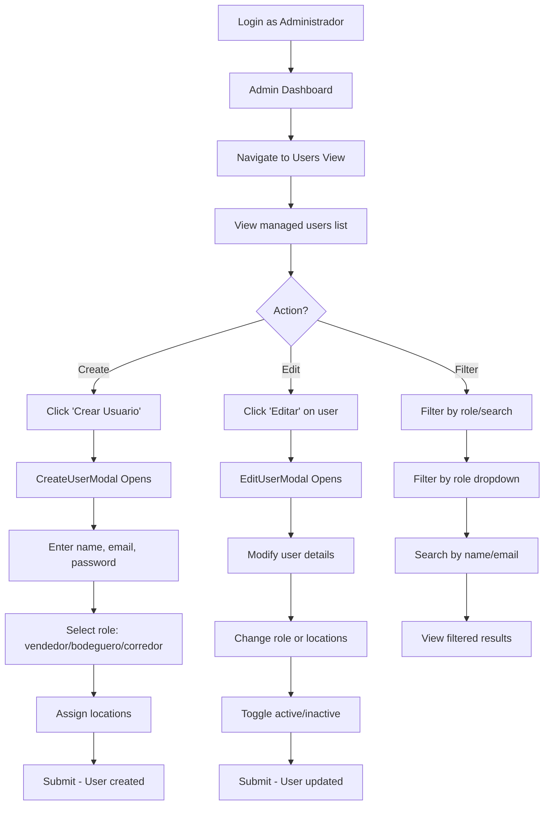

## User Flow 2: Manage Operational Costs

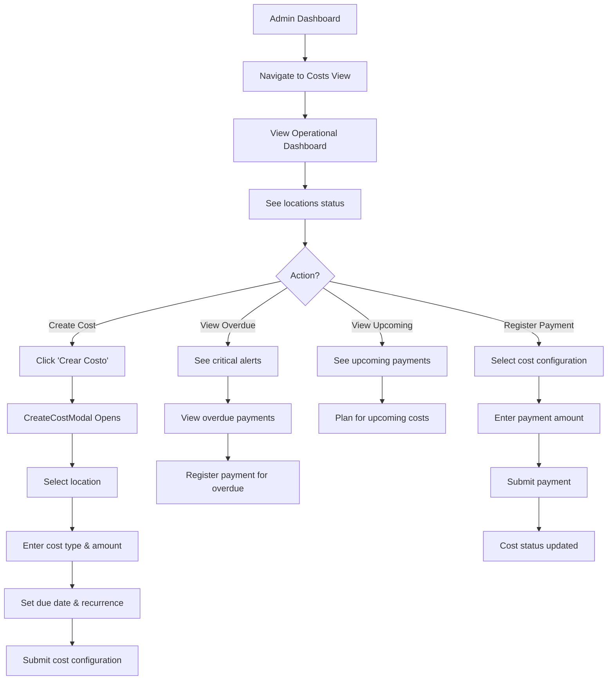

## User Flow 3: Inventory Management

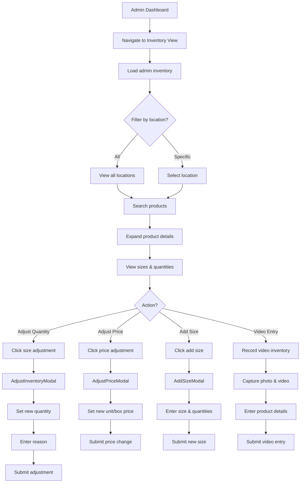

## User Flow 4: Approve Discount Requests

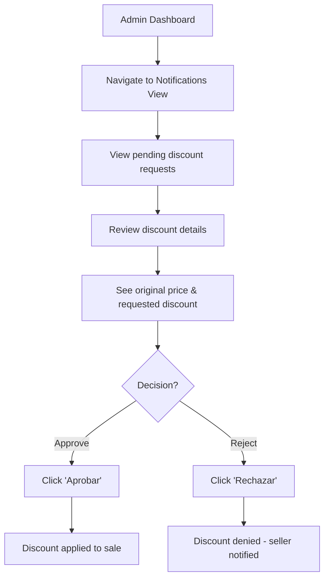

## User Flow 5: View Reports & Traceability

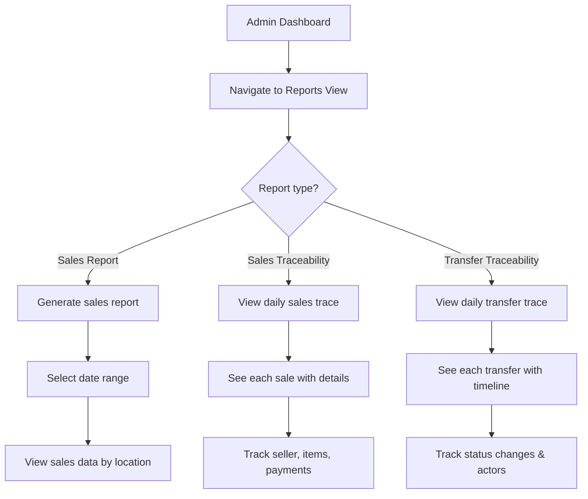

## User Flow 6: Wholesale Management (Mayoreo)

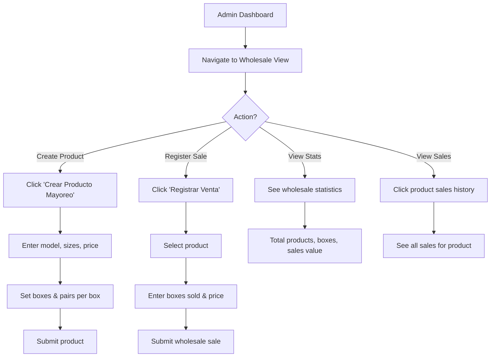

## Sequence Diagram: User Management

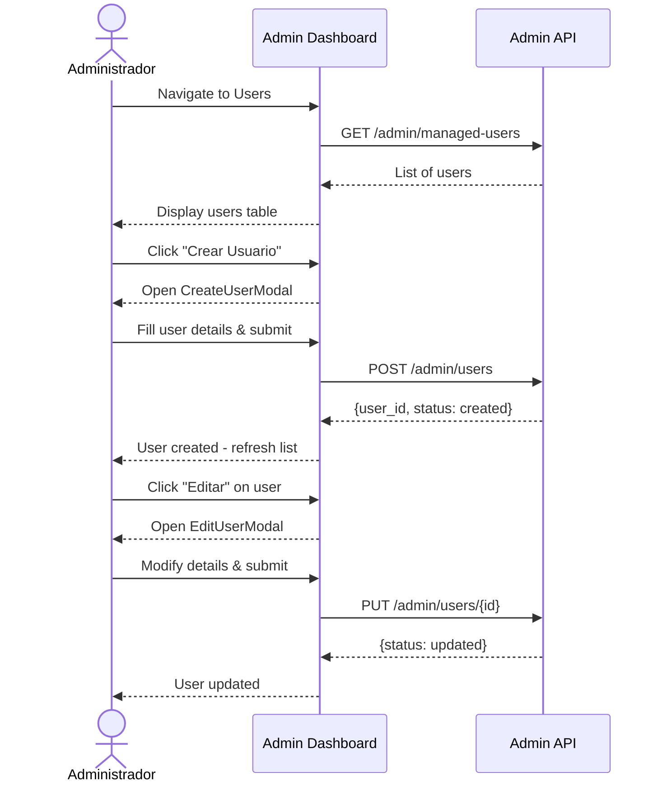

## Sequence Diagram: Cost Management

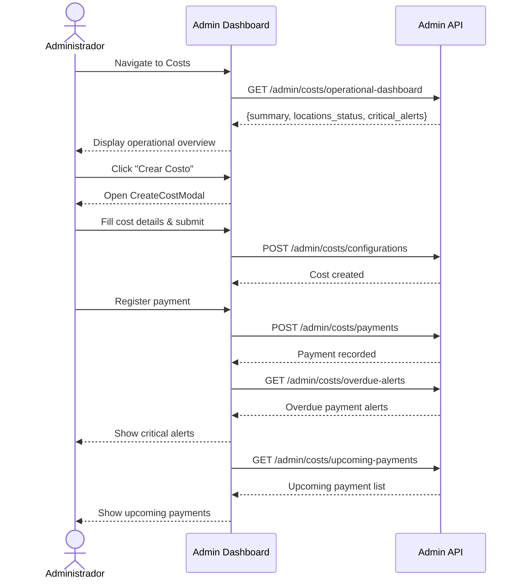

## Sequence Diagram: Inventory Adjustment

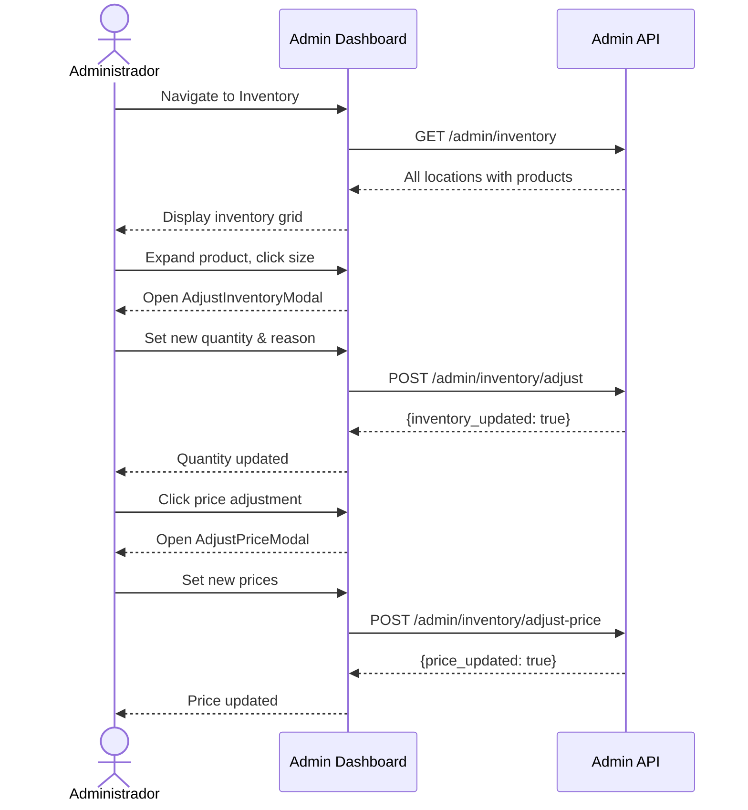

## Sequence Diagram: Dashboard Overview Load

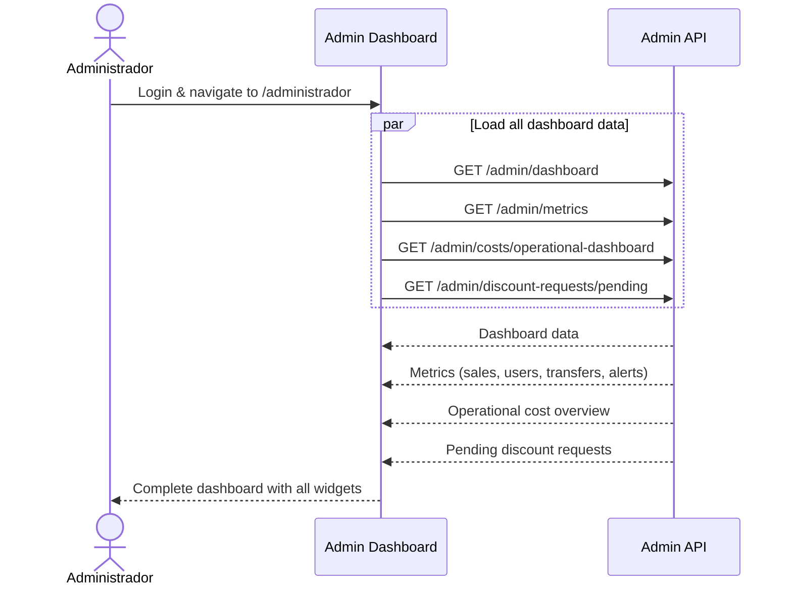

## State Machine: Admin Views

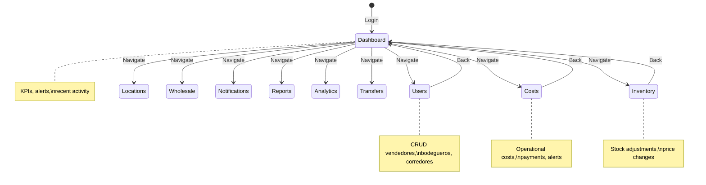

---

## API Endpoints Used

### Dashboard & Metrics
| Endpoint | Method | Description |
|----------|--------|-------------|
| `/admin/dashboard` | GET | Get admin dashboard overview |
| `/admin/metrics` | GET | Get key performance metrics |
| `/admin/system/overview` | GET | Get system health overview |

### User Management
| Endpoint | Method | Description |
|----------|--------|-------------|
| `/admin/users` | POST | Create a new user |
| `/admin/managed-users` | GET | List all managed users |
| `/admin/users/{id}` | PUT | Update user details |
| `/admin/available-locations` | GET | Get locations for user assignment |

### Location Management
| Endpoint | Method | Description |
|----------|--------|-------------|
| `/admin/managed-locations` | GET | List managed locations |
| `/admin/location-statistics` | GET | Get location performance stats |

### Cost Management
| Endpoint | Method | Description |
|----------|--------|-------------|
| `/admin/costs/configurations` | POST | Create cost configuration |
| `/admin/costs/configurations` | GET | List cost configurations |
| `/admin/costs/configurations/{id}` | GET | Get specific cost config |
| `/admin/costs/configurations/{id}` | PUT | Update cost config |
| `/admin/costs/configurations/{id}` | DELETE | Delete cost config |
| `/admin/costs/configurations/{id}/deactivate` | POST | Deactivate cost |
| `/admin/costs/payments` | POST | Register a payment |
| `/admin/costs/operational-dashboard` | GET | Operational overview |
| `/admin/costs/location-dashboard` | GET | Location cost dashboard |
| `/admin/costs/overdue-alerts` | GET | Get overdue payment alerts |
| `/admin/costs/upcoming-payments` | GET | Get upcoming payments |
| `/admin/costs/health` | GET | Cost module health |

### Sales & Reports
| Endpoint | Method | Description |
|----------|--------|-------------|
| `/admin/reports/sales` | GET | Generate sales reports |
| `/admin/reports/daily-sales-traceability` | GET | Daily sales traceability |

### Discounts
| Endpoint | Method | Description |
|----------|--------|-------------|
| `/admin/discount-requests/pending` | GET | Get pending discount requests |
| `/admin/discount-requests/{id}/approve` | POST | Approve/reject discount |

### Transfers
| Endpoint | Method | Description |
|----------|--------|-------------|
| `/admin/transfers/overview` | GET | Get transfers overview |
| `/admin/transfers/daily-traceability` | GET | Daily transfer traceability |

### Inventory
| Endpoint | Method | Description |
|----------|--------|-------------|
| `/admin/inventory` | GET | Get full admin inventory |
| `/admin/inventory/adjust` | POST | Adjust inventory quantity |
| `/admin/inventory/adjust-price` | POST | Adjust product price |
| `/admin/inventory/alerts` | POST | Configure inventory alerts |

### Performance & Analytics
| Endpoint | Method | Description |
|----------|--------|-------------|
| `/admin/users/performance` | GET | Get user performance data |
| `/admin/product-assignments` | GET | Get product assignments |

### Video Inventory
| Endpoint | Method | Description |
|----------|--------|-------------|
| `/admin/video-inventory/process` | POST | Process video inventory entry |
| `/admin/video-inventory/history` | GET | Get processing history |

### Wholesale (Mayoreo)
| Endpoint | Method | Description |
|----------|--------|-------------|
| `/mayoreo/productos` | POST | Create wholesale product |
| `/mayoreo/productos` | GET | List wholesale products |
| `/mayoreo/productos/{id}` | PUT | Update wholesale product |
| `/mayoreo/productos/{id}` | DELETE | Delete wholesale product |
| `/mayoreo/ventas` | POST | Register wholesale sale |
| `/mayoreo/ventas` | GET | List wholesale sales |
| `/mayoreo/ventas/producto/{id}` | GET | Get sales by product |
| `/mayoreo/estadisticas` | GET | Get wholesale statistics |

---

## Key Features

- **Full user CRUD** for vendedores, bodegueros, and corredores
- **Operational cost management** with payments, alerts, and overdue tracking
- **Inventory adjustments** (quantity, pricing, add sizes)
- **Video inventory entry** with photo and video capture
- **Sales reports** with daily traceability
- **Transfer monitoring** with overview and traceability
- **Discount approval** workflow for seller-requested discounts
- **Wholesale module** for bulk product management
- **Location management** with statistics per location
- **Performance analytics** across all users
- **System health monitoring** with microservice connectivity checks
