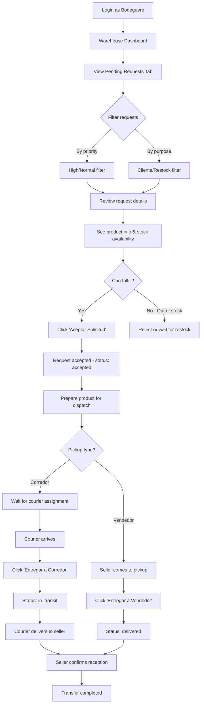
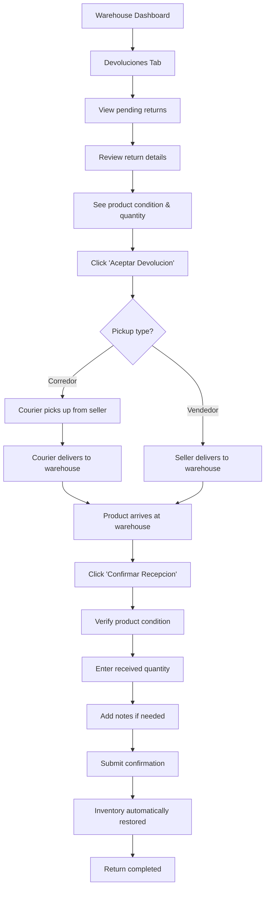
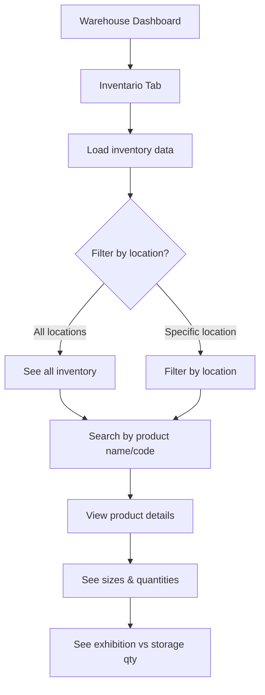
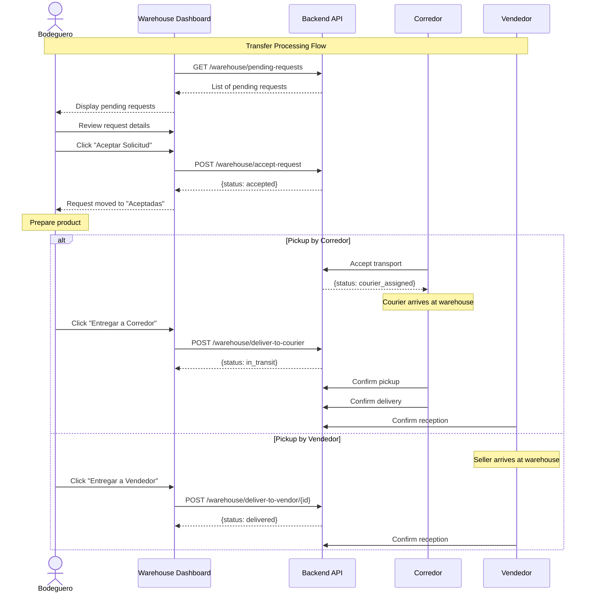
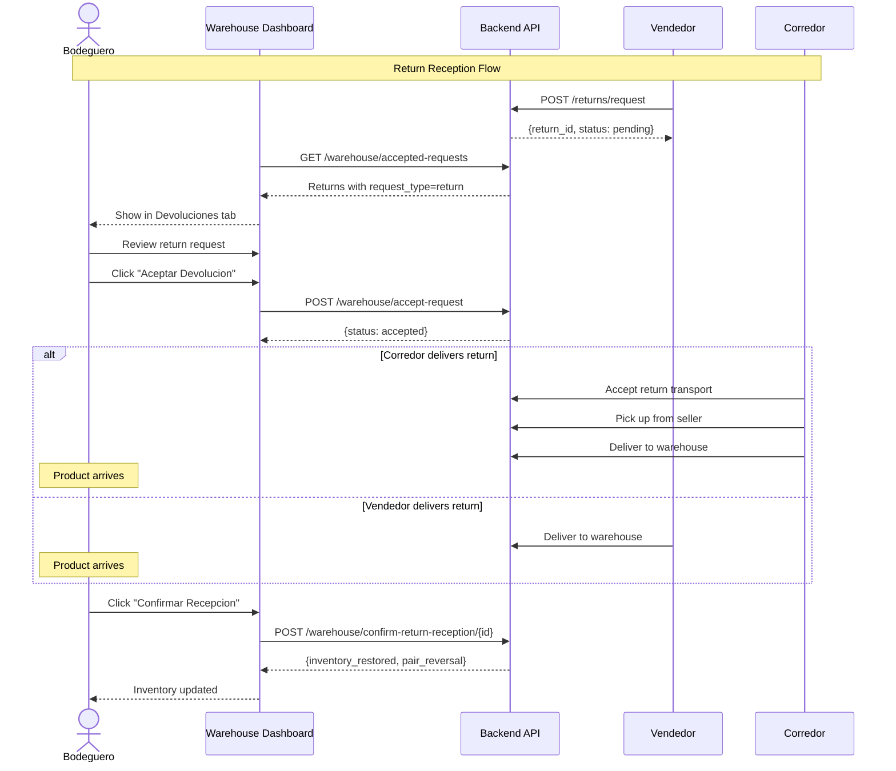
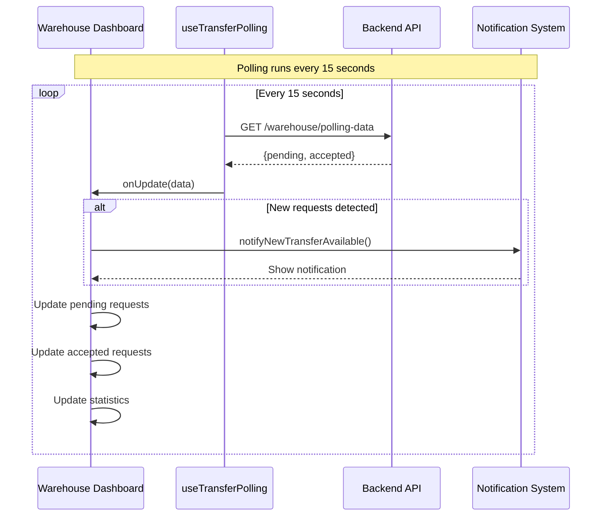
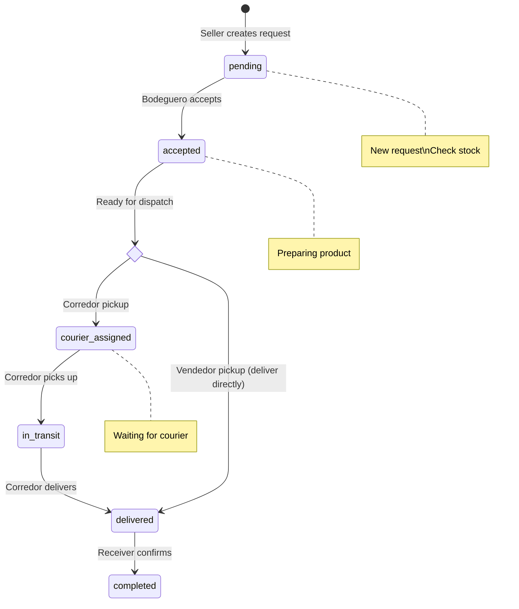
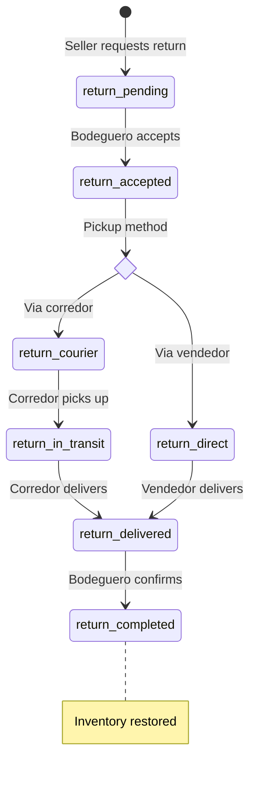

# Bodeguero (Warehouse Keeper) - User Flows & Sequences

## Overview

The **Bodeguero** (Warehouse Keeper) manages warehouse inventory, processes transfer requests from sellers, prepares products for dispatch, coordinates with couriers, and handles product returns.

**Route:** `/warehouse`
**Role key:** `bodeguero`
**Dashboard:** `WarehouseDashboard`

---

## Navigation & Tabs

| Tab | Description |
|-----|-------------|
| Pendientes | Pending transfer requests to accept |
| Aceptadas | Accepted requests being processed |
| Inventario | Warehouse inventory view |
| Estadisticas | Warehouse performance stats |
| Devoluciones | Pending return requests |
| Historial | Daily transfer history |

---

## User Flow 1: Process a Transfer Request

## User Flow 2: Handle a Return (Devolucion)

## User Flow 3: View Inventory

## Sequence Diagram: Accept & Dispatch Transfer

## Sequence Diagram: Return Reception

## Sequence Diagram: Real-time Polling

## State Machine: Request Processing (Bodeguero Perspective)

## State Machine: Return Processing

---

## API Endpoints Used

| Endpoint | Method | Description |
|----------|--------|-------------|
| `/warehouse/pending-requests` | GET | Get pending transfer requests |
| `/warehouse/accept-request` | POST | Accept a transfer request |
| `/warehouse/accepted-requests` | GET | Get accepted/in-progress requests |
| `/warehouse/deliver-to-courier` | POST | Hand off product to courier |
| `/warehouse/deliver-to-vendor/{id}` | POST | Hand off product to vendor |
| `/warehouse/confirm-return-reception/{id}` | POST | Confirm return reception |
| `/warehouse/daily-transfer-history` | GET | Get today's transfer history |

---

## Key Features

- **Real-time polling** every 15 seconds for new requests
- **Notifications** for new transfer and return requests
- **Stock availability check** when reviewing requests
- **Inventory view** with location filtering and search
- **Return management** with inventory auto-restoration
- **Separate handling** for corredor vs vendedor pickups
- **Priority indicators** (URGENT / NORMAL) on requests
- **Preparation instructions** for special items (single feet, pair formation)
