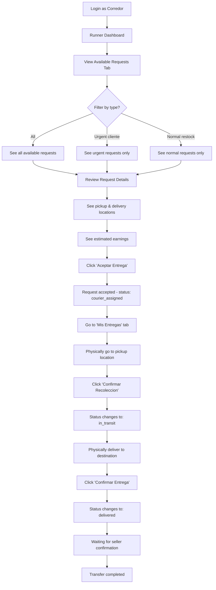
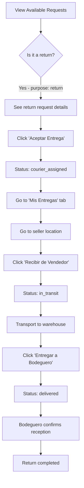
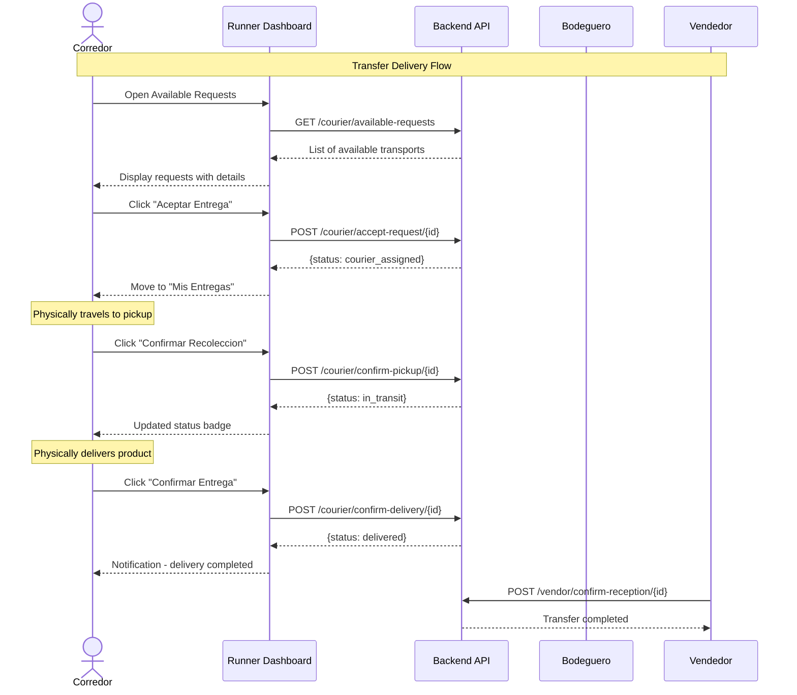
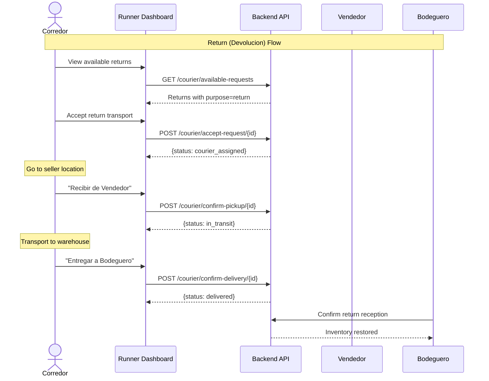
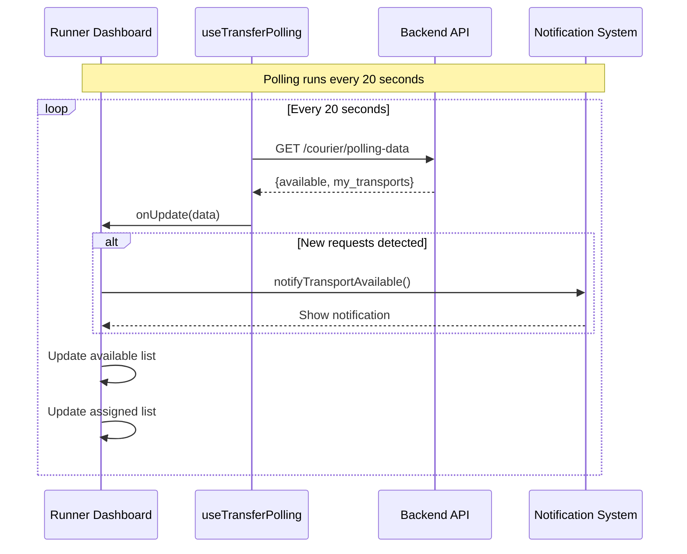
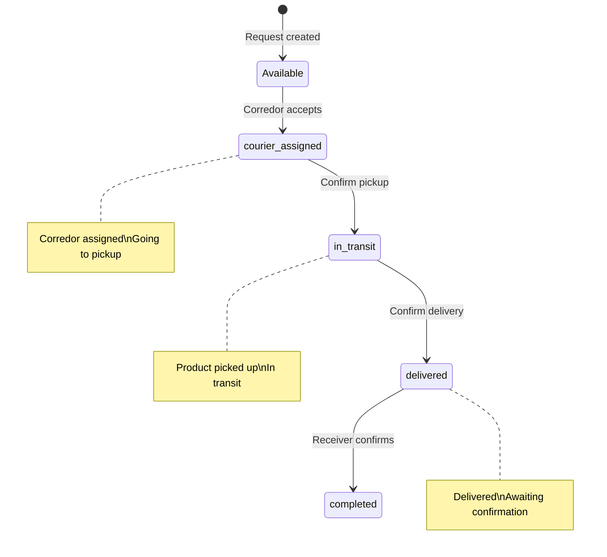

# Corredor (Runner) - User Flows & Sequences

## Overview

The **Corredor** (Runner/Courier) is responsible for physically transporting products between locations (bodegas and locals/stores). They pick up products from warehouses and deliver them to sellers, or pick up returns from sellers and deliver them back to warehouses.

**Route:** `/runner`
**Role key:** `corredor`
**Dashboard:** `RunnerDashboard`

---

## Navigation & Tabs

| Tab | Description |
|-----|-------------|
| Disponibles | Available delivery requests to accept |
| Mis Entregas | Currently assigned transports |
| Historial | Completed deliveries history |
| Estadisticas | Performance stats & metrics |

---

## User Flow 1: Accept & Complete a Regular Transfer

## User Flow 2: Accept & Complete a Return (Devolucion)

## Sequence Diagram: Transfer Delivery Flow

## Sequence Diagram: Return Flow

## Sequence Diagram: Real-time Polling

## State Machine: Transport Status

---

## API Endpoints Used

| Endpoint | Method | Description |
|----------|--------|-------------|
| `/courier/available-requests` | GET | Get available delivery requests |
| `/courier/accept-request/{id}` | POST | Accept a transport request |
| `/courier/my-transports` | GET | Get assigned transports |
| `/courier/confirm-pickup/{id}` | POST | Confirm product pickup |
| `/courier/confirm-delivery/{id}` | POST | Confirm product delivery |
| `/courier/my-deliveries` | GET | Get delivery history |

---

## Key Features

- **Real-time polling** every 20 seconds for new available requests
- **Notifications** when new transport requests appear
- **Estimated earnings** calculated based on distance and urgency
- **Filter** by purpose (cliente/urgent vs restock/normal)
- **Separate flows** for regular transfers and returns (devoluciones)
- **Mobile-responsive** design with collapsible card details
