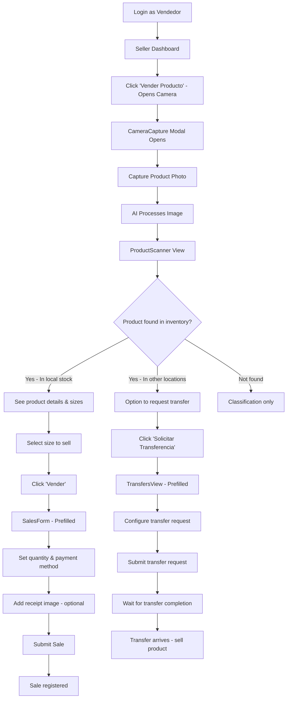
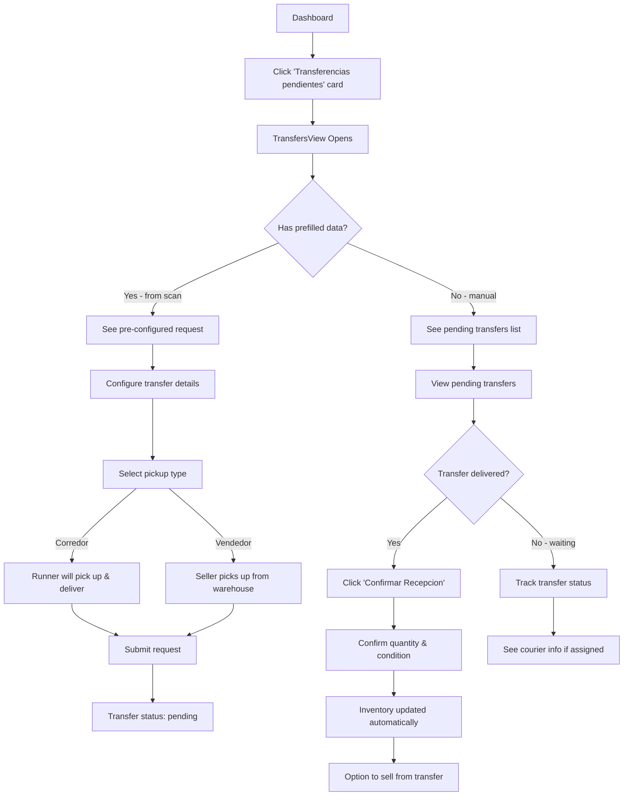
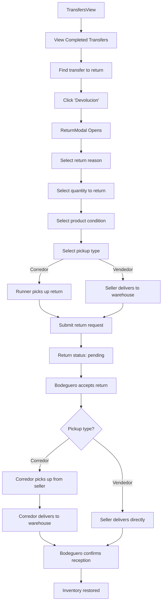
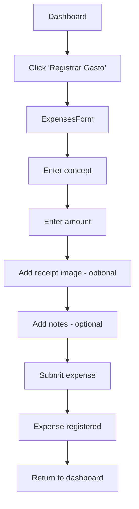
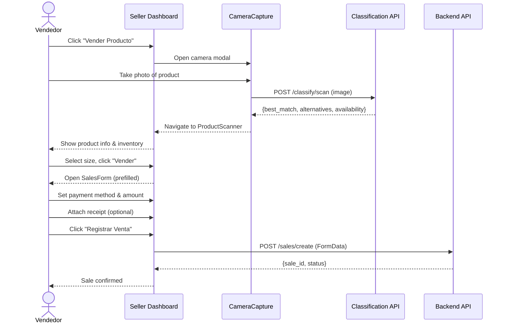
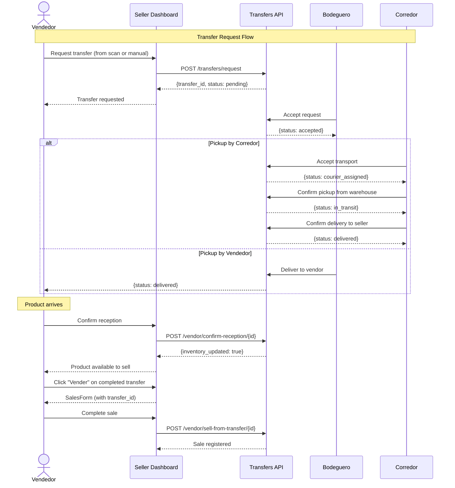
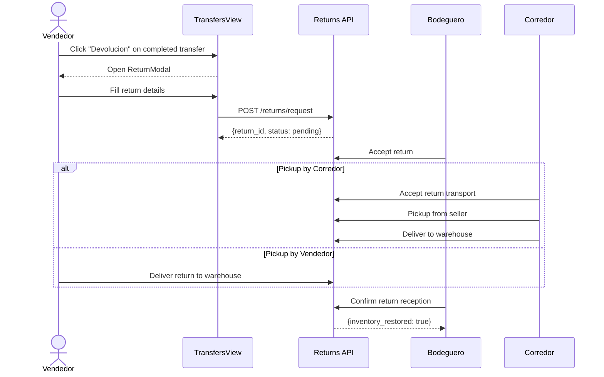
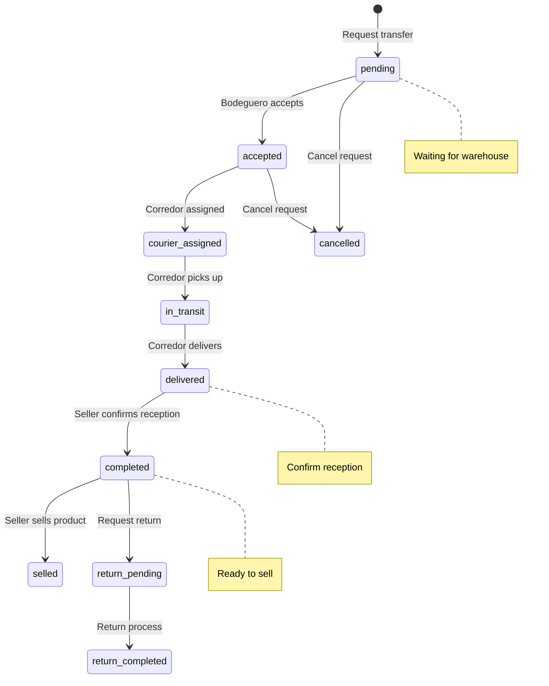

# Vendedor (Seller) - User Flows & Sequences

## Overview

The **Vendedor** (Seller) is the primary point-of-sale user. They scan products, register sales, manage transfers (requesting products from warehouses), handle returns, record expenses, and track daily performance.

**Route:** `/seller`
**Role key:** `seller`
**Dashboard:** `SellerDashboard`

---

## Navigation & Views

| View | Description |
|------|-------------|
| Dashboard | Quick actions, vendor info, daily summary, transfer summary |
| Scan | Product scanning via camera (AI classification) |
| New Sale | Sales form with payment methods |
| Today Sales | List of today's sales with confirmation status |
| Expenses | Register daily expenses |
| Expenses List | View today's expenses |
| Transfers | Manage transfer requests, pending, completed, returns |
| Notifications | Notifications view |

---

## User Flow 1: Scan Product & Sell

## User Flow 2: Request a Transfer

## User Flow 3: Register a Return (Devolucion)

## User Flow 4: Register Expenses

## Sequence Diagram: Complete Sale Flow

## Sequence Diagram: Transfer Request & Reception

## Sequence Diagram: Return Flow

## State Machine: Transfer Lifecycle (Seller Perspective)

---

## API Endpoints Used

| Endpoint | Method | Description |
|----------|--------|-------------|
| `/vendor/dashboard` | GET | Get seller dashboard data |
| `/classify/scan` | POST | Scan product image (AI) |
| `/sales/create` | POST | Create a new sale (FormData) |
| `/sales/today` | GET | Get today's sales |
| `/sales/confirm` | POST | Confirm a pending sale |
| `/expenses/create` | POST | Register an expense (FormData) |
| `/expenses/today` | GET | Get today's expenses |
| `/transfers/request` | POST | Request a product transfer |
| `/transfers/request-single-foot` | POST | Request single foot transfer |
| `/vendor/pending-transfers` | GET | Get pending transfers (reception) |
| `/vendor/completed-transfers` | GET | Get completed transfers |
| `/vendor/confirm-reception/{id}` | POST | Confirm product reception |
| `/vendor/sell-from-transfer/{id}` | POST | Sell from completed transfer |
| `/vendor/cancel-transfer/{id}` | POST | Cancel a transfer |
| `/returns/request` | POST | Request a return |
| `/vendor/incoming-transfers` | GET | Get incoming transfers |
| `/vendor/incoming-transfers/{id}/accept` | POST | Accept incoming transfer |
| `/discounts/request` | POST | Request a discount |

---

## Key Features

- **AI-powered product scanning** via camera with classification
- **Multiple payment methods** (efectivo, tarjeta, transferencia)
- **Transfer management** with real-time status tracking
- **Return flow** with reason, condition, and pickup type selection
- **Expense tracking** with receipt image upload
- **Sale confirmations** for pending sales
- **Discount requests** to admin
- **Transfer polling** for real-time updates
