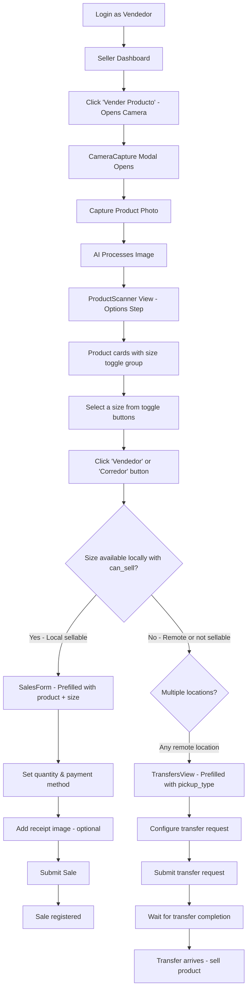
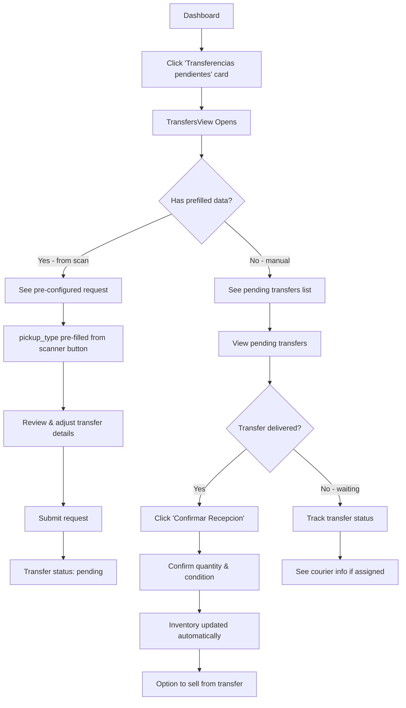
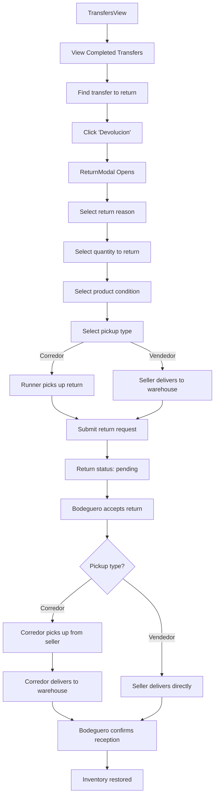
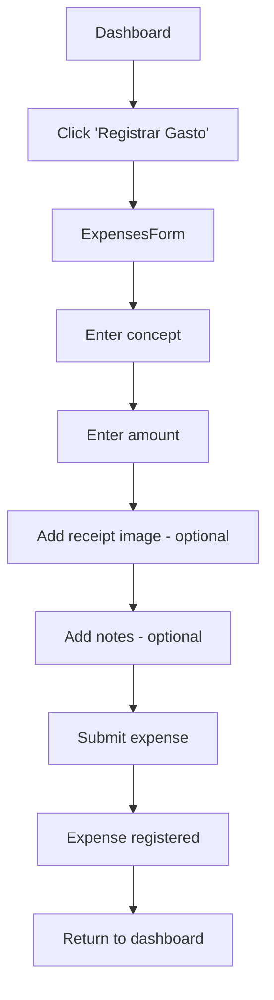
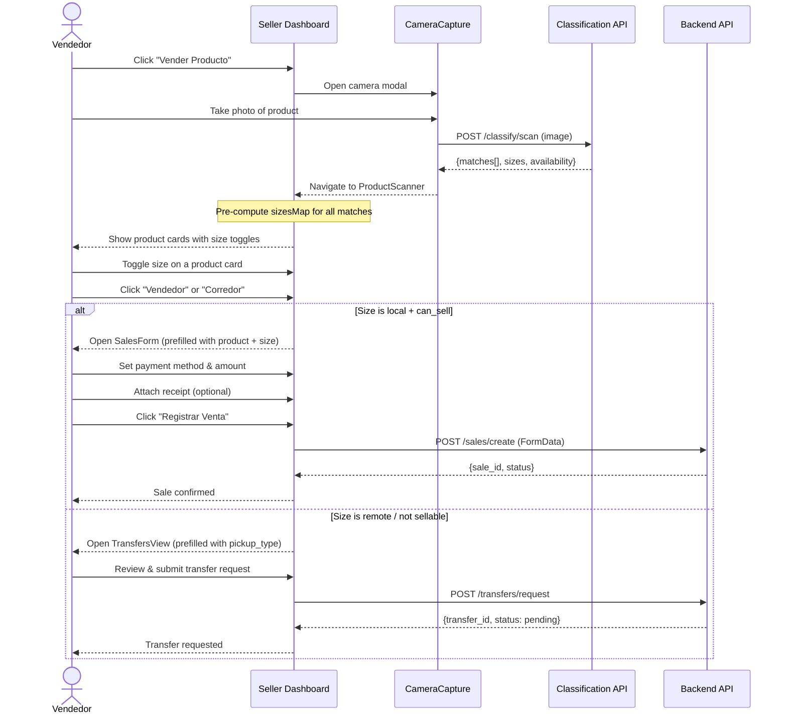
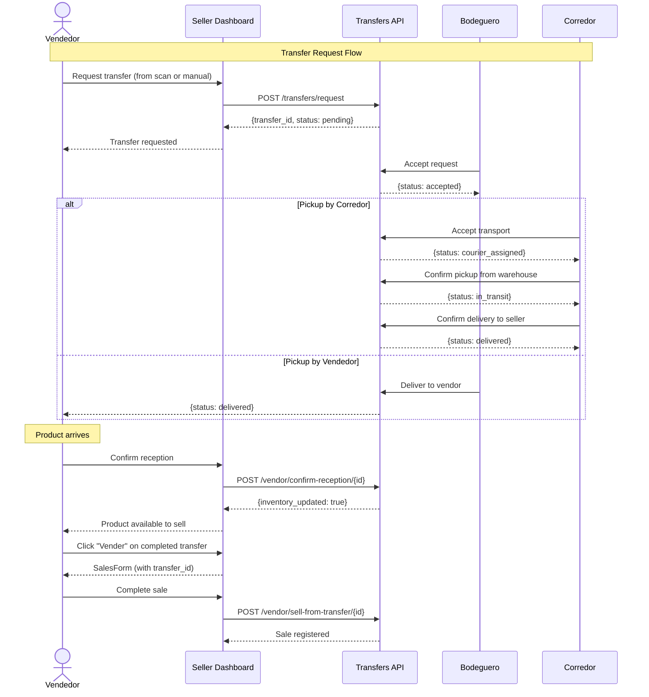
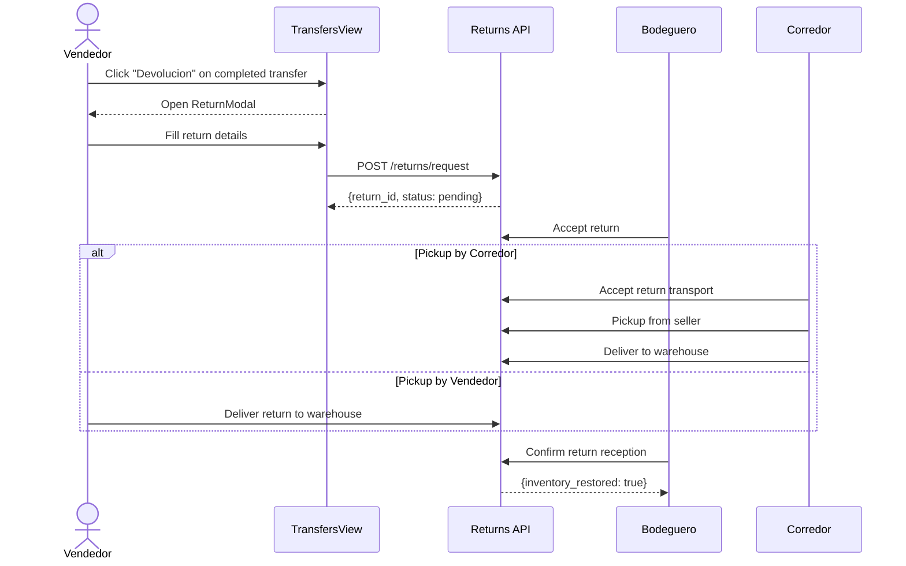
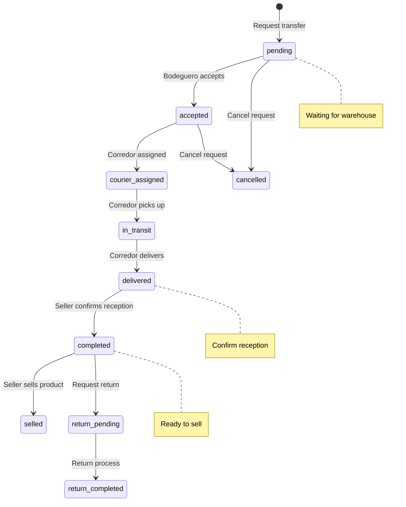

# Vendedor (Seller) - User Flows & Sequences

## Overview

The **Vendedor** (Seller) is the primary point-of-sale user. They scan products, register sales, manage transfers (requesting products from warehouses), handle returns, record expenses, and track daily performance.

**Route:** `/seller`
**Role key:** `seller`
**Dashboard:** `SellerDashboard`

---

## Navigation & Views

| View | Description |
|------|-------------|
| Dashboard | Quick actions, vendor info, daily summary, transfer summary |
| Scan | Product scanning via camera (AI classification) |
| New Sale | Sales form with payment methods |
| Today Sales | List of today's sales with confirmation status |
| Expenses | Register daily expenses |
| Expenses List | View today's expenses |
| Transfers | Manage transfer requests, pending, completed, returns |
| Notifications | Notifications view |

---

## User Flow 1: Scan Product & Direct Action

The scan flow uses a **2-step process**: Options → Direct Action. After scanning, the seller sees product cards with **interactive size toggles** and two action buttons (**Vendedor** / **Corredor**). Selecting a size and clicking an action button triggers the appropriate flow immediately, without an intermediate "details" view.

**Decision logic:**
- If the selected size is **local + can_sell=true** → always redirects to **Nueva Venta** (regardless of which button was clicked)
- If the selected size is **not locally sellable** → redirects to **Solicitud de Transferencia** with `pickup_type` pre-filled based on the button clicked



### ProductOptionsCard Layout (per product card)

```
[ Image ] [ Info: brand, model, confidence, price                ]
          [ Toggle sizes: [7🟢] [7.5] [8🟢] [8.5] [9] ...       ]
          [ [Vender]  (if can_sell)  OR  [Vendedor] [Corredor]    ]
```

- **Size toggles**: Single-select, all sizes shown (no truncation). Sizes are active if they have any stock (complete pairs, left feet, or right feet); sizes with no stock at all are disabled/grey. **Green toggles** indicate sizes available for direct sale (`can_sell=true`); **primary-colored toggles** indicate sizes that require a transfer.
- **"Vender" button** (green, single): Shown when the selected size has `can_sell=true`. Redirects directly to Nueva Venta.
- **"Vendedor" / "Corredor" buttons**: Shown when the selected size requires a transfer. Sets `pickup_type` accordingly.
- **Card border**: Green when the product has at least one directly sellable size; default border otherwise (never red).
- Buttons are **disabled** until a size is selected (only applies to transfer buttons; the "Vender" button only appears when a sellable size is already selected)

## User Flow 2: Request a Transfer

When coming from the scanner, the `pickup_type` field is **pre-filled** based on which button the seller clicked (Vendedor or Corredor). The seller can still change it in the form if needed.



## User Flow 3: Register a Return (Devolucion)



## User Flow 4: Register Expenses



## Sequence Diagram: Complete Sale Flow (Direct Action)



## Sequence Diagram: Transfer Request & Reception



## Sequence Diagram: Return Flow



## State Machine: Transfer Lifecycle (Seller Perspective)



---

## API Endpoints Used

| Endpoint | Method | Description |
|----------|--------|-------------|
| `/vendor/dashboard` | GET | Get seller dashboard data |
| `/classify/scan` | POST | Scan product image (AI) |
| `/sales/create` | POST | Create a new sale (FormData) |
| `/sales/today` | GET | Get today's sales |
| `/sales/confirm` | POST | Confirm a pending sale |
| `/expenses/create` | POST | Register an expense (FormData) |
| `/expenses/today` | GET | Get today's expenses |
| `/transfers/request` | POST | Request a product transfer |
| `/transfers/request-single-foot` | POST | Request single foot transfer |
| `/vendor/pending-transfers` | GET | Get pending transfers (reception) |
| `/vendor/completed-transfers` | GET | Get completed transfers |
| `/vendor/confirm-reception/{id}` | POST | Confirm product reception |
| `/vendor/sell-from-transfer/{id}` | POST | Sell from completed transfer |
| `/vendor/cancel-transfer/{id}` | POST | Cancel a transfer |
| `/returns/request` | POST | Request a return |
| `/vendor/incoming-transfers` | GET | Get incoming transfers |
| `/vendor/incoming-transfers/{id}/accept` | POST | Accept incoming transfer |
| `/discounts/request` | POST | Request a discount |

---

## Key Features

- **AI-powered product scanning** via camera with classification
- **Direct action flow**: Select size → click "Vender" (direct sale) or "Vendedor"/"Corredor" (transfer) → immediate redirect (no intermediate details step)
- **Interactive size toggle group**: Single-select, all sizes visible, green for directly sellable sizes (`can_sell`), primary color for transfer-required sizes, disabled when no stock exists. Considers complete pairs + individual feet (left/right).
- **Smart routing**: Sellable sizes show single green "Vender" button → Nueva Venta; transfer-required sizes show "Vendedor"/"Corredor" buttons → Transferencia with pre-filled `pickup_type`
- **Multiple payment methods** (efectivo, tarjeta, transferencia)
- **Transfer management** with real-time status tracking and pre-filled pickup type
- **Return flow** with reason, condition, and pickup type selection
- **Expense tracking** with receipt image upload
- **Sale confirmations** for pending sales
- **Discount requests** to admin
- **Transfer polling** for real-time updates
